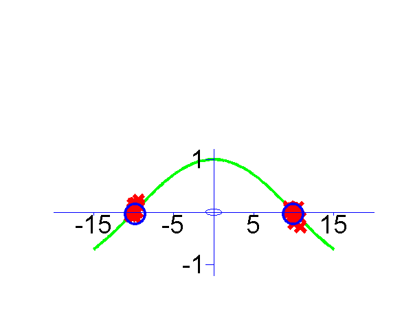
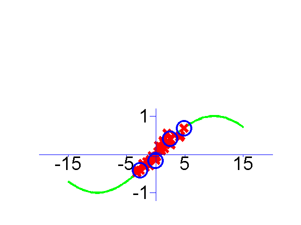
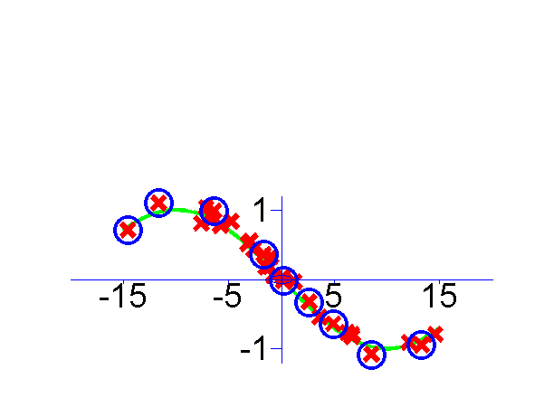

MT-IVM Software
===============

This page describes examples of how to use the Multi-task IVM Software (MT-IVM).

Release Information
-------------------

**Current release is 0.142**.

As well as downloading the MTIVM software you need to obtain the toolboxes specified below. **These can be downloaded using the *same* password you get from registering for the MTIVM software.**

|----------------------------------------------------------------------------|-------------|
| **Toolbox**                                                                | **Version** |
| [IVM](http://inverseprobability.com/ivm/downloadFiles/vrs0p4)             | 0.4         |
| [NETLAB](http://inverseprobability.com/netlab/downloadFiles/vrs3p3)       | 3.3         |
| [NDLUTIL](http://inverseprobability.com/ndlutil/downloadFiles/vrs0p161)   | 0.161       |
| [KERN](http://inverseprobability.com/kern/downloadFiles/vrs0p223)         | 0.223       |
| [NOISE](http://inverseprobability.com/noise/downloadFiles/vrs0p14)        | 0.14        |
| [PRIOR](http://inverseprobability.com/prior/downloadFiles/vrs0p22)        | 0.22        |
| [OPTIMI](http://inverseprobability.com/optimi/downloadFiles/vrs0p132)     | 0.132       |
| [DATASETS](http://inverseprobability.com/datasets/downloadFiles/vrs0p136) | 0.136       |
| [MLTOOLS](http://inverseprobability.com/mltools/downloadFiles/vrs0p1311)  | 0.1311      |
| [DRAWING](http://inverseprobability.com/drawing/downloadFiles/vrs0p111)   | 0.111       |

Fixes to icmlVowelDemo.

### Version 0.141

This release is simply a freshen up to get plots ready for talks in Madrid.

#### Release 0.14

This release cleans up some missing dependencies and bugs pointed out by Kervin Murphy.

Unfortunately the software here will not recreate the experiments in the ICML paper as, due to the anonymous submission procedure I failed to freeze the code after submission. My apologies for this.

The original ICML version relied on old IVM code that predates the version on the web. This version relies on the new IVM toolbox which is a lot more modular.

Examples
--------

`demToySine`
------------

The first example given is `demToySine` which is a simple multi-task Gaussian Process Regression data set, using three sine waves with different phases. The input sampling distribution is different for each \`task'. This means the tasks contain differing amounts of information.

The result of learning is shown below, active points are circled.

Regression from the `demToySine.m` example. Data is shown as crosses. Circled crosses are points selected for the active set.

Page updated on Wed Aug 12 22:40:27 2009
